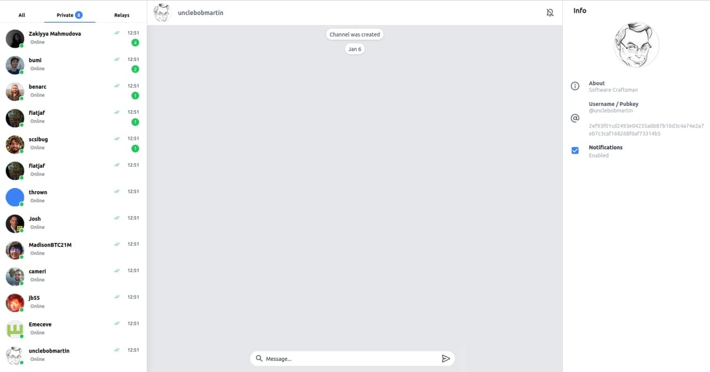

<div align="center">
  <h1>Nostr Chat</h1>
</div>

<div align="center">  
Nostr Chat UI
</div>

---



---

<div align="center">
<h4>Getting Started</h4>
</div>
  
---
  
[](https://github.com/melvincarvalho/nostr.chat/blob/gh-pages/LICENSE)
[](https://npmjs.com/package/nostr-chat)
[](https://npmjs.com/package/nostr-chat)
[](https://github.com/melvincarvalho/nostr.chat/)

## Introduction

Nostr Chat is a chat interface for the [nostr](https://github.com/fiatjaf/nostr) network

Run your own, or demo can be seen at [nostr.chat](https://nostr.chat)

## Installation

Nostr.chat does not have any dependencies, just run a web server on the files and you are ready to go

Alternatively run from npm using serve

```sh
npx nostr-chat
```

## License

- MIT